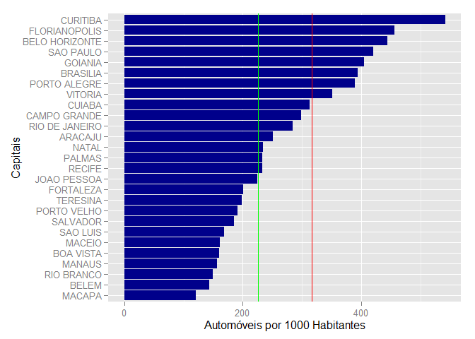

# População e Frota de Veículos
Mario Azevedo  
Sunday, May 24, 2015  

###Carregando as bibliotecas necessárias


```r
library(data.table)
library(dplyr)
library(stringr)
library(knitr)
options(scipen=1, digits=2, width=105)
```

###Lendo os dados


```r
dados <- fread('FrotaBR122013.csv',sep=';')
estados <- fread('estados.csv',sep=';')
estados <- mutate(estados,CAPITAL=str_trim(CAPITAL))
estados <- mutate(estados,ESTADO=str_trim(ESTADO))
setkey(dados,UF)
setkey(estados,SIGLA)
dados <- select(dados[estados],-c(ESTADO,CAPITAL))
```

###Características Gerais

1. Número de municípios, população e frota total, de automóveis e motocicletas por estado


```r
tabela <- group_by(dados,UF) %>%
        summarise(Nmun = n(),
                  Populacao = sum(POPULACAO),
                  Veiculos = sum(TOTAL),
                  Automoveis = sum(AUTOMOVEL),
                  Motocicletas = sum(MOTOCICLETA))

kable(tabela)
```


UF    Nmun   Populacao   Veiculos   Automoveis   Motocicletas
---  -----  ----------  ---------  -----------  -------------
AC      22      776463     205777        67461          86048
AL     102     3300935     614566       275556         199317
AM      62     3807921     700849       325698         183987
AP      16      734996     152634        64386          50326
BA     417    15044137    3158326      1415342        1002208
CE     184     8778576    2384395       881571        1045078
DF       1     2789761    1511110      1099719         154277
ES      78     3839366    1585076       797528         373365
GO     246     6434048    3169088      1512266         743879
MA     217     6794301    1215478       335793         601923
MG     853    20593356    8884663      4926454        2106326
MS      79     2587269    1253199       580821         313390
MT     141     3182113    1565739       543484         495288
PA     144     7999729    1428355       455649         593828
PB     223     3914421     959085       407624         366699
PE     185     9208550    2396738      1088338         828291
PI     224     3184166     855445       255114         410745
PR     399    10997465    6351183      3759306        1011274
RJ      92    16369179    5568514      3839651         748356
RN     167     3373959     967299       430289         340918
RO      52     1728214     758308       212652         319337
RR      15      488072     165339        53704          64676
RS     497    11164043    5885383      3622309         959339
SC     295     6634254    4201255      2428891         763019
SE      75     2195662     575510       262664         190159
SP     645    43663669   24560201     15643414        3978276
TO     139     1478164     527213       158702         184135

2. População e frota total, de automóveis e motocicletas das capitais


```r
tabela <- filter(dados, str_c(UF,MUNICIPIO,sep='-') %in% 
                         str_c(estados$SIGLA,estados$CAPITAL,sep='-')) %>%
        mutate(APM = 1000 * AUTOMOVEL/POPULACAO) %>%
        mutate(MPM = 1000 * MOTOCICLETA/POPULACAO) %>%
        select(UF,MUNICIPIO,POPULACAO,TOTAL,AUTOMOVEL,APM,MOTOCICLETA,MPM) %>%
        arrange(desc(APM))

kable(tabela)
```


UF   MUNICIPIO         POPULACAO     TOTAL   AUTOMOVEL   APM   MOTOCICLETA   MPM
---  ---------------  ----------  --------  ----------  ----  ------------  ----
PR   CURITIBA            1848946   1429534     1000903   541        128882    70
SC   FLORIANOPOLIS        453285    305028      206845   456         41553    92
MG   BELO HORIZONTE      2479165   1596081     1101919   444        197150    80
SP   SAO PAULO          11821873   7010508     4971813   421        799411    68
GO   GOIANIA             1393575   1045796      564554   405        206724   148
DF   BRASILIA            2789761   1511110     1099719   394        154277    55
RS   PORTO ALEGRE        1467816    802932      571299   389         83947    57
ES   VITORIA              348268    185427      122229   351         19861    57
MT   CUIABA               569830    344189      178035   312         74171   130
MS   CAMPO GRANDE         832352    483039      248372   298        114443   137
RJ   RIO DE JANEIRO      6429923   2451155     1824803   284        238855    37
SE   ARACAJU              614577    257261      154271   251         50421    82
RN   NATAL                853928    339429      200312   235         76403    89
TO   PALMAS               257904    144562       60132   233         38772   150
PE   RECIFE              1599513    609765      371833   232        119498    75
PB   JOAO PESSOA          769607    298796      172667   224         77126   100
CE   FORTALEZA           2551806    908074      511109   200        229154    90
PI   TERESINA             836475    380576      166131   199        133767   160
RO   PORTO VELHO          484992    222218       92648   191         71455   147
BA   SALVADOR            2883682    785257      533990   185        105207    36
MA   SAO LUIS            1053922    327808      177176   168         78601    75
AL   MACEIO               996733    266465      161275   162         51637    52
RR   BOA VISTA            308996    145678       49527   160         54343   176
AM   MANAUS              1982177    581179      311179   157        121656    61
AC   RIO BRANCO           357194    139683       53215   149         53553   150
PA   BELEM               1425922    373846      204801   144         88211    62
AP   MACAPA               437256    121519       52922   121         38673    88

```r
barplot(tabela$APM,names.arg=tabela$MUNICIPIO,
        ylab='Veiculos por 1000 habitantes',space=1)
```

 

3. População e frota total, de automóveis e motocicletas das regiões


```r
tabela <- group_by(dados,REGIAO) %>%
                summarise(Populacao = sum(POPULACAO),
                  Veiculos = sum(TOTAL),
                  Automoveis = sum(AUTOMOVEL),
                  Motocicletas = sum(MOTOCICLETA)) %>%
        mutate(APM = 1000 * Automoveis/Populacao) %>%
        mutate(MPM = 1000 * Motocicletas/Populacao) %>%
        select(REGIAO,Populacao,Veiculos,Automoveis,APM,Motocicletas,MPM) %>%
        arrange(desc(APM))
        
kable(tabela)
```


REGIAO    Populacao   Veiculos   Automoveis   APM   Motocicletas   MPM
-------  ----------  ---------  -----------  ----  -------------  ----
S          28795762   16437821      9810506   341        2733632    95
SE         84465570   40598454     25207047   298        7206323    85
CO         14993191    7499136      3736290   249        1706834   114
NE         55794707   13126842      5352291    96        4985338    89
N          17013559    3938475      1338252    79        1482337    87

```r
barplot(tabela$APM,names.arg=tabela$REGIAO,
        ylab='Veiculos por 1000 habitantes')
```

 

