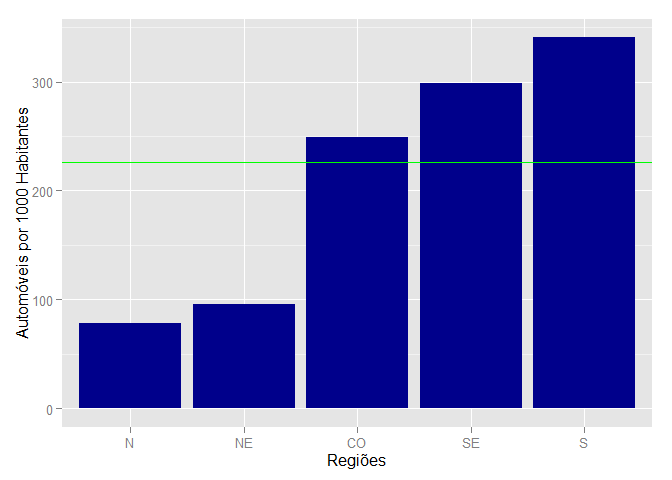

# População e Frota de Veículos
Mario Azevedo  
Domingo, 24/05/2015  

###Carregando as bibliotecas necessárias


```r
library(data.table)
library(dplyr)
library(stringr)
library(knitr)
library(pander)
library(ggplot2)
library(scales)
options(scipen=1, digits=2, width=105)
```

###Lendo os dados

Os dados da frota são de dezembro de 2013 (DENATRAN). Os dados de população são de outubro de 2013 (estimativa do IBGE).


```r
dados <- fread('FrotaBR122013.csv',sep=';')
estados <- fread('estados.csv',sep=';')
estados <- mutate(estados,CAPITAL=str_trim(CAPITAL))
estados <- mutate(estados,ESTADO=str_trim(ESTADO))
setkey(dados,UF)
setkey(estados,SIGLA)
dados <- select(dados[estados],-c(ESTADO,CAPITAL))
```

###Características Gerais

####1. Para os estados: número de municípios, população, frota total, taxa de veículos por 1000 habitantes (VPM), frota de automóveis e taxa de automóveis por 1000 habitantes (APM). Lista em ordem decrescente de APM.


```r
tabela <- group_by(dados,UF) %>%
        summarise(Nmun = n(),
                  Populacao = sum(POPULACAO),
                  Veiculos = sum(TOTAL),
                  VPM = 1000 * sum(TOTAL)/sum(POPULACAO),                
                  Automoveis = sum(AUTOMOVEL),
                  APM = 1000 * sum(AUTOMOVEL)/sum(POPULACAO)) %>%
        arrange(desc(APM))
kable(tabela)
```


UF    Nmun   Populacao   Veiculos   VPM   Automoveis   APM
---  -----  ----------  ---------  ----  -----------  ----
DF       1     2789761    1511110   542      1099719   394
SC     295     6634254    4201255   633      2428891   366
SP     645    43663669   24560201   562     15643414   358
PR     399    10997465    6351183   578      3759306   342
RS     497    11164043    5885383   527      3622309   324
MG     853    20593356    8884663   431      4926454   239
GO     246     6434048    3169088   493      1512266   235
RJ      92    16369179    5568514   340      3839651   235
MS      79     2587269    1253199   484       580821   224
ES      78     3839366    1585076   413       797528   208
MT     141     3182113    1565739   492       543484   171
RN     167     3373959     967299   287       430289   128
RO      52     1728214     758308   439       212652   123
SE      75     2195662     575510   262       262664   120
PE     185     9208550    2396738   260      1088338   118
RR      15      488072     165339   339        53704   110
TO     139     1478164     527213   357       158702   107
PB     223     3914421     959085   245       407624   104
CE     184     8778576    2384395   272       881571   100
BA     417    15044137    3158326   210      1415342    94
AP      16      734996     152634   208        64386    88
AC      22      776463     205777   265        67461    87
AM      62     3807921     700849   184       325698    86
AL     102     3300935     614566   186       275556    83
PI     224     3184166     855445   269       255114    80
PA     144     7999729    1428355   179       455649    57
MA     217     6794301    1215478   179       335793    49

####2. Para as capitais: população, frota total, taxa de veículos por 1000 habitantes (VPM), frota de automóveis, taxa de automóveis por 1000 habitantes (APM), frota de motocicletas e taxa de motocicletas por 1000 habitantes (MPM). Lista em ordem decrescente de APM.


```r
tabela <- filter(dados, str_c(UF,MUNICIPIO,sep='-') %in% 
                         str_c(estados$SIGLA,estados$CAPITAL,sep='-')) %>%
        mutate(VPM = 1000 * TOTAL/POPULACAO) %>%
        mutate(APM = 1000 * AUTOMOVEL/POPULACAO) %>%
        mutate(MPM = 1000 * MOTOCICLETA/POPULACAO) %>%
        select(UF,MUNICIPIO,POPULACAO,TOTAL,VPM,AUTOMOVEL,APM,MOTOCICLETA,MPM) %>%
        arrange(desc(APM))

APMcap <- 1000 * sum(tabela$AUTOMOVEL)/sum(tabela$POPULACAO)
APMbr <- 1000 * sum(dados$AUTOMOVEL)/sum(dados$POPULACAO)
kable(tabela)
```


UF   MUNICIPIO         POPULACAO     TOTAL   VPM   AUTOMOVEL   APM   MOTOCICLETA   MPM
---  ---------------  ----------  --------  ----  ----------  ----  ------------  ----
PR   CURITIBA            1848946   1429534   773     1000903   541        128882    70
SC   FLORIANOPOLIS        453285    305028   673      206845   456         41553    92
MG   BELO HORIZONTE      2479165   1596081   644     1101919   444        197150    80
SP   SAO PAULO          11821873   7010508   593     4971813   421        799411    68
GO   GOIANIA             1393575   1045796   750      564554   405        206724   148
DF   BRASILIA            2789761   1511110   542     1099719   394        154277    55
RS   PORTO ALEGRE        1467816    802932   547      571299   389         83947    57
ES   VITORIA              348268    185427   532      122229   351         19861    57
MT   CUIABA               569830    344189   604      178035   312         74171   130
MS   CAMPO GRANDE         832352    483039   580      248372   298        114443   137
RJ   RIO DE JANEIRO      6429923   2451155   381     1824803   284        238855    37
SE   ARACAJU              614577    257261   419      154271   251         50421    82
RN   NATAL                853928    339429   397      200312   235         76403    89
TO   PALMAS               257904    144562   561       60132   233         38772   150
PE   RECIFE              1599513    609765   381      371833   232        119498    75
PB   JOAO PESSOA          769607    298796   388      172667   224         77126   100
CE   FORTALEZA           2551806    908074   356      511109   200        229154    90
PI   TERESINA             836475    380576   455      166131   199        133767   160
RO   PORTO VELHO          484992    222218   458       92648   191         71455   147
BA   SALVADOR            2883682    785257   272      533990   185        105207    36
MA   SAO LUIS            1053922    327808   311      177176   168         78601    75
AL   MACEIO               996733    266465   267      161275   162         51637    52
RR   BOA VISTA            308996    145678   471       49527   160         54343   176
AM   MANAUS              1982177    581179   293      311179   157        121656    61
AC   RIO BRANCO           357194    139683   391       53215   149         53553   150
PA   BELEM               1425922    373846   262      204801   144         88211    62
AP   MACAPA               437256    121519   278       52922   121         38673    88

```r
ordem <- reorder(tabela$MUNICIPIO,tabela$APM)
ggplot(data=tabela, aes(x=ordem, y=APM)) +
        geom_bar(stat="identity",fill="darkblue") +
        coord_flip() +
        geom_hline(aes(yintercept=APMcap),color="red") +
        geom_hline(aes(yintercept=APMbr),color="green") +
        xlab("Capitais") +
        ylab("Automóveis por 1000 Habitantes")
```

 

####3. População e frota total, de automóveis e motocicletas das regiões


```r
tabela <- group_by(dados,REGIAO) %>%
                summarise(Populacao = sum(POPULACAO),
                  Veiculos = sum(TOTAL),
                  Automoveis = sum(AUTOMOVEL),
                  Motocicletas = sum(MOTOCICLETA)) %>%
        mutate(APM = 1000 * Automoveis/Populacao) %>%
        mutate(MPM = 1000 * Motocicletas/Populacao) %>%
        select(REGIAO,Populacao,Veiculos,Automoveis,APM,Motocicletas,MPM) %>%
        arrange(desc(APM))
kable(tabela)
```


REGIAO    Populacao   Veiculos   Automoveis   APM   Motocicletas   MPM
-------  ----------  ---------  -----------  ----  -------------  ----
S          28795762   16437821      9810506   341        2733632    95
SE         84465570   40598454     25207047   298        7206323    85
CO         14993191    7499136      3736290   249        1706834   114
NE         55794707   13126842      5352291    96        4985338    89
N          17013559    3938475      1338252    79        1482337    87

```r
ordem <- reorder(tabela$REGIAO,tabela$APM)
ggplot(data=tabela, aes(x=ordem, y=APM)) +
        geom_bar(stat="identity",fill="darkblue") +
        geom_hline(aes(yintercept=APMbr),color="green") +
        xlab("Regiões") +
        ylab("Automóveis por 1000 Habitantes")
```

 

####4. As 10 cidades brasileiras com maiores percentuais de motocicletas na frota. 


```r
tabela <- mutate(dados,percM = 100 * MOTOCICLETA/TOTAL) %>%
        arrange(desc(percM)) %>%
        select(MUNICIPIO,UF,TOTAL,MOTOCICLETA,percM)
kable(tabela[1:10])
```


MUNICIPIO                  UF    TOTAL   MOTOCICLETA   percM
-------------------------  ---  ------  ------------  ------
MARAJA DO SENA             MA      367           341      93
SAO ROBERTO                MA      623           537      86
LAGOA DO MATO              MA     1162           991      85
BACURITUBA                 MA      419           356      85
LAGOA GRANDE DO MARANHAO   MA      818           695      85
CURUA                      PA      365           309      85
SAO JOAO DO CARU           MA      746           630      84
PEREIRO                    CE     7342          6180      84
DUQUE BACELAR              MA      633           531      84
LIMOEIRO DO AJURU          PA      155           130      84

####5. As 10 cidades brasileiras com maiores taxas de automóveis por 1000 habitantes. 


```r
tabela <- mutate(dados,APM = 1000 * AUTOMOVEL/POPULACAO) %>%
        select(MUNICIPIO,UF,POPULACAO,AUTOMOVEL,APM) %>%
        arrange(desc(APM))
kable(tabela[1:10])
```


MUNICIPIO                      UF    POPULACAO   AUTOMOVEL   APM
-----------------------------  ---  ----------  ----------  ----
SAO CAETANO DO SUL             SP       156362       98738   631
SANTA BARBARA DO MONTE VERDE   MG         2972        1811   609
RIO PRETO                      MG         5487        3249   592
CURITIBA                       PR      1848946     1000903   541
VINHEDO                        SP        69845       37051   530
BOM JESUS DO NORTE             ES        10095        5290   524
CAMPINAS                       SP      1144862      565408   494
SANTO ANDRE                    SP       704942      347984   494
AGUAS DE SAO PEDRO             SP         3004        1471   490
RIO BONITO                     RJ        56942       27447   482

####6. Relação completa dos estados, destacando o número de cidades nas quais a frota de motocicletas é maior do que a de automóveis.


```r
tabela <- mutate(dados,maismoto = (MOTOCICLETA>AUTOMOVEL)) %>%
        group_by(UF) %>%
        summarise(Nmun=n(),
                  MaisMoto = sum(maismoto),
                  percMun = 100 * sum(maismoto)/n())

#kable(tabela,caption = "Cidades com mais motocicletas do que automóveis, por estado")
panderOptions('table.split.table', Inf)
pandoc.table(tabela, style = "rmarkdown",
             caption = "**Cidades com mais motocicletas do que automóveis, por estado**",
             justify = c('left',rep('right',3)),
             digits=5,round=1,big.mark=".",decimal.mark=',',
             emphasize.strong.cols=1)
```


| UF     |   Nmun |   MaisMoto |   percMun |
|:-------|-------:|-----------:|----------:|
| **AC** |     22 |         22 |       100 |
| **AL** |    102 |         74 |      72,5 |
| **AM** |     62 |         58 |      93,5 |
| **AP** |     16 |          9 |      56,2 |
| **BA** |    417 |        303 |      72,7 |
| **CE** |    184 |        174 |      94,6 |
| **DF** |      1 |          0 |         0 |
| **ES** |     78 |         29 |      37,2 |
| **GO** |    246 |         44 |      17,9 |
| **MA** |    217 |        214 |      98,6 |
| **MG** |    853 |        278 |      32,6 |
| **MS** |     79 |          8 |      10,1 |
| **MT** |    141 |        111 |      78,7 |
| **PA** |    144 |        139 |      96,5 |
| **PB** |    223 |        190 |      85,2 |
| **PE** |    185 |        145 |      78,4 |
| **PI** |    224 |        223 |      99,6 |
| **PR** |    399 |          0 |         0 |
| **RJ** |     92 |          4 |       4,3 |
| **RN** |    167 |        151 |      90,4 |
| **RO** |     52 |         49 |      94,2 |
| **RR** |     15 |         14 |      93,3 |
| **RS** |    497 |          2 |       0,4 |
| **SC** |    295 |          0 |         0 |
| **SE** |     75 |         55 |      73,3 |
| **SP** |    645 |          1 |       0,2 |
| **TO** |    139 |        131 |      94,2 |

Table: **Cidades com mais motocicletas do que automóveis, por estado**

####7. Relação completa dos estados, destacando a frota de certos tipos de veículos e quanto isso representa em relação ao país.


```r
popBR <- sum(dados$POPULACAO)
frotaBR <- sum(dados$TOTAL)
autoBR <- sum(dados$AUTOMOVEL)
oniBR <- sum(dados$ONIBUS)
camBR <- sum(dados$CAMINHAO)
tabela <- group_by(dados,UF) %>%
        summarise(Populacao = sum(POPULACAO),
                  pPop = 100 * sum(POPULACAO)/popBR,
                  Automoveis = sum(AUTOMOVEL),
                  pAuto = 100 * sum(AUTOMOVEL)/autoBR,
                  Onibus = sum(ONIBUS),
                  pOni = 100 * sum(ONIBUS)/oniBR,
                  Caminhoes = sum(CAMINHAO),
                  pCam = 100 * sum(CAMINHAO)/camBR)
Brasil <- data.table(UF = 'TOTAL',
                     Populacao = popBR,
                     pPop = 100.0,
                     Automoveis = autoBR,
                     pAuto = 100.0,
                     Onibus = oniBR,
                     pOni = 100.0,
                     Caminhoes = camBR,
                     pCam = 100.0)
tabela<-rbind(tabela,Brasil)
linha=nrow(tabela)
#panderOptions('knitr.auto.asis', FALSE)
panderOptions('table.split.table', Inf)
pandoc.table(tabela, style = "rmarkdown",
             justify = c('center',rep('right',8)),
             digits=12,round=1,big.mark=".",decimal.mark=',',
             emphasize.strong.rows=linha,
             emphasize.strong.cols=1)
```


|    UF     |       Populacao |    pPop |     Automoveis |   pAuto |      Onibus |    pOni |     Caminhoes |    pCam |
|:---------:|----------------:|--------:|---------------:|--------:|------------:|--------:|--------------:|--------:|
|  **AC**   |         776.463 |     0,4 |         67.461 |     0,1 |         921 |     0,2 |         6.297 |     0,3 |
|  **AL**   |       3.300.935 |     1,6 |        275.556 |     0,6 |       6.098 |     1,1 |        18.949 |     0,8 |
|  **AM**   |       3.807.921 |     1,9 |        325.698 |     0,7 |       8.517 |     1,6 |        19.023 |     0,8 |
|  **AP**   |         734.996 |     0,4 |         64.386 |     0,1 |         917 |     0,2 |         3.678 |     0,1 |
|  **BA**   |      15.044.137 |     7,5 |      1.415.342 |     3,1 |      34.421 |     6,3 |       106.213 |     4,3 |
|  **CE**   |       8.778.576 |     4,4 |        881.571 |     1,9 |      14.014 |     2,6 |        61.047 |     2,5 |
|  **DF**   |       2.789.761 |     1,4 |      1.099.719 |     2,4 |      10.755 |       2 |        21.801 |     0,9 |
|  **ES**   |       3.839.366 |     1,9 |        797.528 |     1,8 |      13.555 |     2,5 |        64.749 |     2,6 |
|  **GO**   |       6.434.048 |     3,2 |      1.512.266 |     3,3 |      19.507 |     3,6 |       100.123 |       4 |
|  **MA**   |       6.794.301 |     3,4 |        335.793 |     0,7 |       6.868 |     1,3 |        33.214 |     1,3 |
|  **MG**   |      20.593.356 |    10,2 |      4.926.454 |    10,8 |      67.366 |    12,3 |       299.132 |      12 |
|  **MS**   |       2.587.269 |     1,3 |        580.821 |     1,3 |       8.199 |     1,5 |        45.487 |     1,8 |
|  **MT**   |       3.182.113 |     1,6 |        543.484 |     1,2 |       9.620 |     1,8 |        59.982 |     2,4 |
|  **PA**   |       7.999.729 |       4 |        455.649 |       1 |      14.414 |     2,6 |        50.422 |       2 |
|  **PB**   |       3.914.421 |     1,9 |        407.624 |     0,9 |       6.520 |     1,2 |        25.508 |       1 |
|  **PE**   |       9.208.550 |     4,6 |      1.088.338 |     2,4 |      17.903 |     3,3 |        83.632 |     3,4 |
|  **PI**   |       3.184.166 |     1,6 |        255.114 |     0,6 |       5.295 |       1 |        22.737 |     0,9 |
|  **PR**   |      10.997.465 |     5,5 |      3.759.306 |     8,3 |      36.912 |     6,7 |       246.111 |     9,9 |
|  **RJ**   |      16.369.179 |     8,1 |      3.839.651 |     8,4 |      44.316 |     8,1 |       132.959 |     5,3 |
|  **RN**   |       3.373.959 |     1,7 |        430.289 |     0,9 |       5.716 |       1 |        27.473 |     1,1 |
|  **RO**   |       1.728.214 |     0,9 |        212.652 |     0,5 |       4.876 |     0,9 |        26.735 |     1,1 |
|  **RR**   |         488.072 |     0,2 |         53.704 |     0,1 |         825 |     0,2 |         3.881 |     0,2 |
|  **RS**   |      11.164.043 |     5,6 |      3.622.309 |       8 |      36.843 |     6,7 |       206.979 |     8,3 |
|  **SC**   |       6.634.254 |     3,3 |      2.428.891 |     5,3 |      17.606 |     3,2 |       139.545 |     5,6 |
|  **SE**   |       2.195.662 |     1,1 |        262.664 |     0,6 |       5.785 |     1,1 |        19.056 |     0,8 |
|  **SP**   |      43.663.669 |    21,7 |     15.643.414 |    34,4 |     145.166 |    26,5 |       643.241 |    25,8 |
|  **TO**   |       1.478.164 |     0,7 |        158.702 |     0,3 |       4.530 |     0,8 |        20.706 |     0,8 |
| **TOTAL** | **201.062.789** | **100** | **45.444.386** | **100** | **547.465** | **100** | **2.488.680** | **100** |

####8. As 10 cidades cearenses com *maior* percentual de motocicletas


```r
tabela <- filter(dados,UF=='CE') %>% 
        mutate(percM = 100 * MOTOCICLETA/TOTAL) %>%
        arrange(desc(percM)) %>%
        select(MUNICIPIO,TOTAL,MOTOCICLETA,percM)
panderOptions('table.split.table', Inf)
pandoc.table(head(tabela,10), style = "rmarkdown",
             caption = "**Cidades cearenses com maior percentual de motocicletas na frota**",
             justify = c('left',rep('right',3)),
             digits=5,round=1,big.mark=".",decimal.mark=',',
             emphasize.strong.cols=1)
```


| MUNICIPIO                     |   TOTAL |   MOTOCICLETA |   percM |
|:------------------------------|--------:|--------------:|--------:|
| **PEREIRO**                   |   7.342 |         6.180 |    84,2 |
| **ARATUBA**                   |   2.171 |         1.711 |    78,8 |
| **DEPUTADO IRAPUAN PINHEIRO** |   2.051 |         1.616 |    78,8 |
| **AIUABA**                    |   2.082 |         1.624 |      78 |
| **QUIXELO**                   |   3.771 |         2.924 |    77,5 |
| **CHORO**                     |   1.963 |         1.516 |    77,2 |
| **ERERE**                     |     784 |           603 |    76,9 |
| **SOLONOPOLE**                |   4.565 |         3.498 |    76,6 |
| **MIRAIMA**                   |   1.569 |         1.191 |    75,9 |
| **MILHA**                     |   3.840 |         2.901 |    75,5 |

Table: **Cidades cearenses com maior percentual de motocicletas na frota**

####9. As 10 cidades cearenses com *menor* percentual de motocicletas


```r
tabela <- arrange(tabela,percM)
panderOptions('table.split.table', Inf)
pandoc.table(head(tabela,10), style = "rmarkdown",
             caption = "**Cidades cearenses com menor percentual de motocicletas na frota**",
             justify = c('left',rep('right',3)),
             digits=5,round=1,big.mark=".",decimal.mark=',',
             emphasize.strong.cols=1)
```


| MUNICIPIO      |   TOTAL |   MOTOCICLETA |   percM |
|:---------------|--------:|--------------:|--------:|
| **FORTALEZA**  | 908.074 |       229.154 |    25,2 |
| **EUSEBIO**    |  16.402 |         4.494 |    27,4 |
| **FORTIM**     |   2.105 |           712 |    33,8 |
| **IPAUMIRIM**  |   8.221 |         3.036 |    36,9 |
| **MARACANAU**  |  51.050 |        19.115 |    37,4 |
| **CASCAVEL**   |  13.655 |         5.127 |    37,5 |
| **BEBERIBE**   |   8.304 |         3.171 |    38,2 |
| **PACAJUS**    |  17.312 |         6.750 |      39 |
| **CHOROZINHO** |   4.349 |         1.720 |    39,5 |
| **CAUCAIA**    |  64.701 |        25.707 |    39,7 |

Table: **Cidades cearenses com menor percentual de motocicletas na frota**

####10. As 10 cidades cearenses com maior numero de automoveis por 1000 habitantes


```r
tabela <- filter(dados,UF=='CE') %>% 
        mutate(APM = 1000 * AUTOMOVEL/POPULACAO) %>%
        select(MUNICIPIO,POPULACAO,AUTOMOVEL,APM) %>%
        arrange(desc(APM))
pandoc.table(head(tabela,10), style = "rmarkdown",
             caption = "**Cidades cearenses com maior numero de automoveis por 1000 habitantes**",
             justify = c('left',rep('right',3)),
             digits=5,round=1,big.mark=".",decimal.mark=',',
             emphasize.strong.cols=1)
```


| MUNICIPIO             |   POPULACAO |   AUTOMOVEL |   APM |
|:----------------------|------------:|------------:|------:|
| **IPAUMIRIM**         |      12.256 |       3.248 |   265 |
| **FORTALEZA**         |   2.551.806 |     511.109 | 200,3 |
| **EUSEBIO**           |      49.455 |       7.050 | 142,6 |
| **MARACANAU**         |     217.922 |      23.899 | 109,7 |
| **JUAZEIRO DO NORTE** |     261.289 |      27.979 | 107,1 |
| **PACAJUS**           |      66.510 |       6.951 | 104,5 |
| **CRATO**             |     126.591 |      13.095 | 103,4 |
| **TIANGUA**           |      72.110 |       7.294 | 101,2 |
| **CHOROZINHO**        |      19.187 |       1.876 |  97,8 |
| **LIMOEIRO DO NORTE** |      57.372 |       5.500 |  95,9 |

Table: **Cidades cearenses com maior numero de automoveis por 1000 habitantes**

####11. As 10 cidades cearenses com maior numero de veículos por 1000 habitantes


```r
tabela <- filter(dados,UF=='CE') %>% 
        mutate(VPM = 1000 * TOTAL/POPULACAO) %>%
        select(MUNICIPIO,POPULACAO,TOTAL,VPM) %>%
        arrange(desc(VPM))
pandoc.table(head(tabela,10), style = "rmarkdown",
             caption = "**Cidades cearenses com maior numero de veículos por 1000 habitantes**",
             justify = c('left',rep('right',3)),
             digits=5,round=1,big.mark=".",decimal.mark=',',
             emphasize.strong.cols=1)
```


| MUNICIPIO                 |   POPULACAO |   TOTAL |   VPM |
|:--------------------------|------------:|--------:|------:|
| **IPAUMIRIM**             |      12.256 |   8.221 | 670,8 |
| **TABULEIRO DO NORTE**    |      30.018 |  14.255 | 474,9 |
| **PEREIRO**               |      16.063 |   7.342 | 457,1 |
| **LIMOEIRO DO NORTE**     |      57.372 |  23.882 | 416,3 |
| **RUSSAS**                |      73.436 |  28.391 | 386,6 |
| **IGUATU**                |     100.053 |  38.514 | 384,9 |
| **SOBRAL**                |     197.663 |  72.730 | 367,9 |
| **TIANGUA**               |      72.110 |  26.303 | 364,8 |
| **FORTALEZA**             |   2.551.806 | 908.074 | 355,9 |
| **SAO JOAO DO JAGUARIBE** |       7.829 |   2.783 | 355,5 |

Table: **Cidades cearenses com maior numero de veículos por 1000 habitantes**
